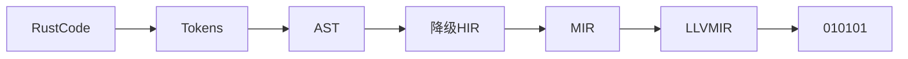

# rust 语法

## rust 语言版本

主版本.次版本.修订号

- 主版本 不兼容得 API 修改
- 次版本 向下兼容得功能性新增
- 修订号 向下兼容的问题修正

## rust 怎么工作的



rust code ->

## rust 词法结构

- 关键字(Keywords)

  - 严格关键字

    - 只能用于特定上下文的关键字 （as 、 break 、 const 、 continue 、 create 、 if 、 else ...）

  - 保留字

    - 现在还没用 将来可能会用到 （abstract 、 become 、 box 、 do 、 final ...）

  - 弱关键字

    - 在特殊得上下文中有特殊的意义 （union 、 'static 、 dyn）

- 标识符(Identifier)

  - 变量名 函数名 类型 （只能由字母 下划线 不能由数字组成）

- 注释(Comment)

  - 模块级别注释 必须放在文件头部

  ```rust
  //! - this is comment
  /*! - this is module comment */
  ```

  - 行注释

  ```rust
  // this is line comment
  ```

  - 行级 文档注释

  ```rust
  /// this is line doc comment
  ```

  - 普通块注释

  ```rust
  /* - this is comment block comment */
  ```

  - 块级文档注释

  ```rust
  /** - this is block doc comment */
  ```

- 空白(Whitespace)

  - \n \t tab 等 ， 任何形式的空白字符在 rust 中只用于分格标记 没有语义意义

- 词条(Tokens)

  - 编译期 Token

- 路径(Path)

  ```rust
  a::b::c::foo()
  ```

## 表达式和语句

1. 声明语句
2. 流程控制语句
3. 表达式语句
4. 宏语句

### rust 语法骨架得三个元素

- 属性 ， 类似与 #![...]
- 分号 ； 行分隔符

  - 分号表达式

    1.返回值永远是自身的单元 Unit 类型

    2.分号表达式只有在快表达式最后一行才会进行求值 其他时候是连接符

    ```rust
    // 单元类型（Unit-type）
    ; -> ()
    ```

- 花括号 {} 块分隔符

### 语句

- 声明语句

  1. use std::alloc;

- 表达式语句

  1. 块中最后一行不加分号的表达式

  ```rust
    fn plus_one(i : &u32) -> u32 {
        let i = i + 1;
        // 不加分号 u32
        i
        // 加分号 return u32
        return i;
        // unit-type ×
        i;
    }
  ```

### 流程控制也是表达式

if else 、 match ...

```rust
fn test() {
    // error
    // 每个流程分支要返回相同的类型
    let a = if (true) { 1 } else { "123" };
}
```

### 操作符也是表达式

操作符表达式存在优先级

[rust 表达式手册](https://rustwiki.org/zh-CN/reference/expressions.html#%E8%A1%A8%E8%BE%BE%E5%BC%8F%E7%9A%84%E4%BC%98%E5%85%88%E7%BA%A7)

## rust 语言编译期计算

### 什么是编译期计算

编译期函数求值 ( CTFE )

### rust 中支持的两种方式

1.过程宏 + build 脚本

2.类似于 Cpp 中 constexpr 得 CTFE

### rust 中得 CTEF

- 常量函数 const fn
- 常量泛型 const generic

## rust 中表达式得分类

```rust
let answer = 42;
```

let 赋值语句中 = 左边是位置表达式 ， 右边是值表达式

### 位置表达式都有哪些

静态变量初始化 比如 static mut levels:u32=0
解引用表达式 比如 \*expr
数组索引表达式 比如 expr[expr]
字段表达式 形如 expr.field
加上括号的位置表达式 如 （expr）

### 位置上下文有哪些

1.复合位置操作

```rust
let mut a = 1;
a += 1; // 复合位置操作
```

2.一元借用和解引用操作中得操作数所在区域

```rust
let a = & mut 7;
*a = 42;
let b = &a;
```

3. 字段表达式得操作数所在区域

```rust
struct A{
    name : &'static str,
}

let a = A{name : "jsy"}

a.name // field expr
```

4.数组索引表达式操作数所在的区域

```rust
let mut a = [1,2,3];
let b = &mut a;
a[1] = 42
```

5.任意隐式借用操作数所在区域

```rust
let mut v = vec![1,2,3];
v.push(4) // 这个 push 方法会隐式得借用 &mut v， 因为push方法第一个参数就是 &mut self
```

6.let 初始化变量但是不赋值

7.if let 、 while let 、 match 得匹配表达式所在区域

8.结构体更新语法中的 base 表达式

```rust
let mut base = Point3D{x : 1 , y : 2 , z : 3};
let y_ref = &mut base.y;
Point3D {y : 0 , z : 10 , ..base}; // 得到 base.x
```

## rust 所有权语义在表达式中的体现

```rust
 let stack_a = 42; // 42 实现了 copy 所以存在栈上
 let stack_b = stack_a;
 stack_a // success

 let heap_a = "a".to_string(); // 字符串在堆上 move 语义
 let heap_b = heap_a;
 heap_a; // error
```

## 可变 不可变

变量默认不可变

```rust
let a = 1;
a = 2; //error
```

```rust
let a = 1;
let a = 2; // success

let mut b = 1;
b = 2; // success
```

引用

``` rust
let answer = 42;
let r = &answer; // r 是 answer 得内存地址 且不可修改
```

``` rust
let mut answer = 42;
let r = &mut answer; // r 是 answer 得内存地址
*r = 43;
answer; // 43
```

