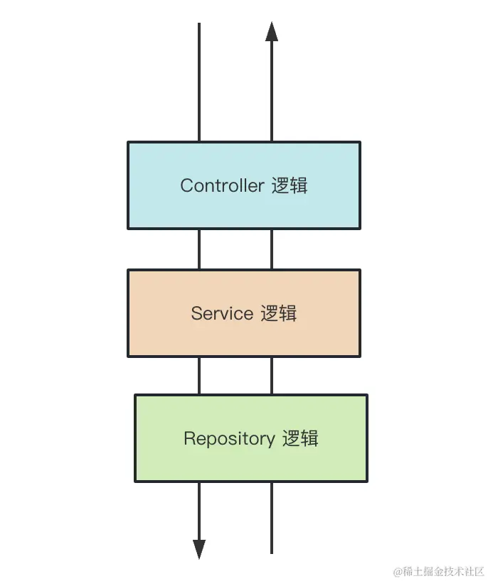
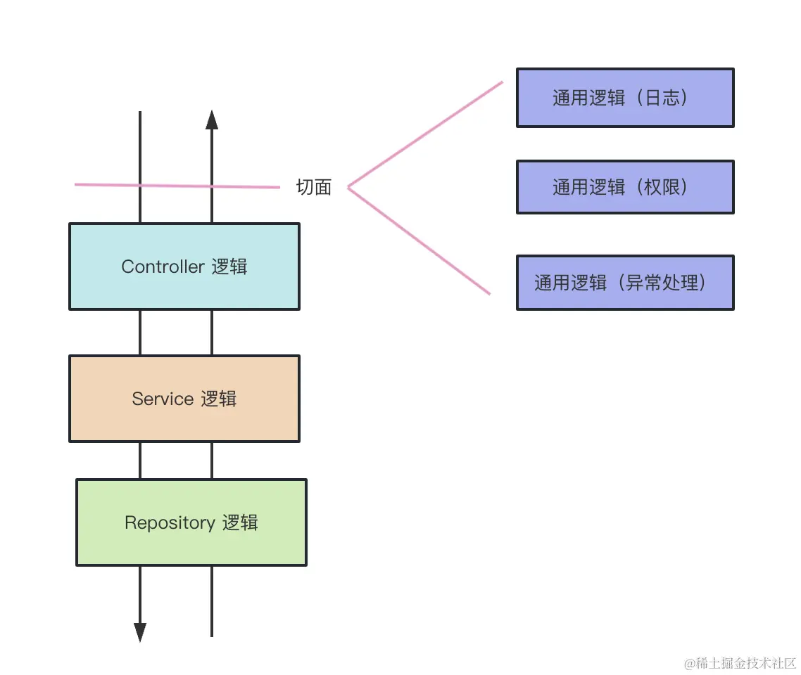
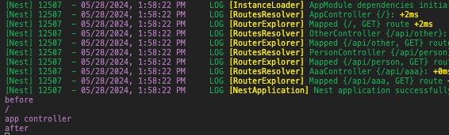
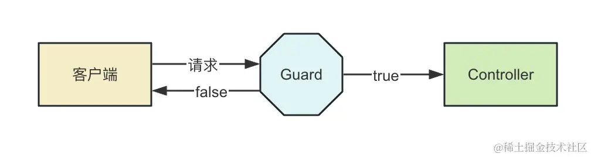
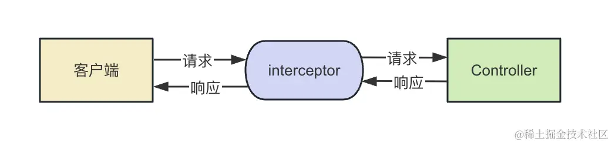
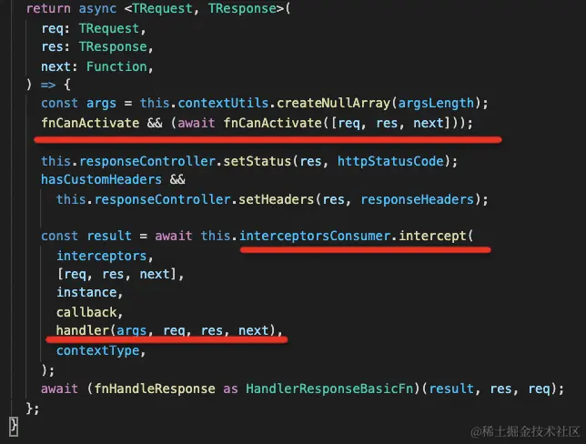

# AOP 架构的好处

AOP 是什么意思呢？什么是面向切面编程呢？

一个请求过来，可能会经过 Controller（控制器）、Service（服务）、Repository（数据库访问） 的逻辑：



如果想在这个调用链路里加入一些通用逻辑该怎么加呢？比如日志记录、权限控制、异常处理等。

容易想到的是直接改造 Controller 层代码，加入这段逻辑。

这样可以，但是不优雅，因为这些通用的逻辑侵入到了业务逻辑里面。能不能透明的给这些业务逻辑加上日志、权限等处理呢？

那是不是可以在调用 Controller 之前和之后加入一个执行通用逻辑的阶段呢？



是不是就和切了一刀一样？

这样的横向扩展点就叫做切面，这种透明的加入一些切面逻辑的编程方式就叫做 AOP （面向切面编程）。

AOP 的好处是可以把一些通用逻辑分离到切面中，保持业务逻辑的纯粹性，这样切面逻辑可以复用，还可以动态的增删。

`Nest 实现 AOP 的方式更多，一共有五种，包括 Middleware、Guard、Pipe、Interceptor、ExceptionFilter。`

# 全局中间件 Middleware

```ts
// main.ts
import { NestFactory } from "@nestjs/core";
import { AppModule } from "./app.module";
import type { NestExpressApplication } from "@nestjs/platform-express";
import { NextFunction, Request, Response } from "express";

async function bootstrap() {
  const app = await NestFactory.create<NestExpressApplication>(AppModule);
  app.use(function (req: Request, res: Response, next: NextFunction) {
    console.log(`before`);
    console.log(req.url);
    next();
    console.log(`after`);
  });
  app.useStaticAssets("public", { prefix: "/static" });
  await app.listen(3000);
}
bootstrap();

// app.controller
import { Controller, Get, Inject } from "@nestjs/common";
import { AppService } from "./app.service";

@Controller()
export class AppController {
  @Inject(AppService)
  private readonly appService: AppService;

  @Get()
  getHello(): string {
    console.log(`app controller`);
    return this.appService.getHello();
  }
}
```

打印结果


这种可以给在 handler 前后动态增加一些可复用的逻辑，就是 AOP 的切面编程的思想。

除了全局中间件，Nest 还支持路由中间件。

## 路由中间件

```sh
nest g middleware log --no-spec --flat
```

```ts
import { Injectable, NestMiddleware } from "@nestjs/common";

@Injectable()
export class LogMiddleware implements NestMiddleware {
  use(req: any, res: any, next: () => void) {
    console.log(`before`);
    next();
    console.log(`after`);
  }
}
```

在 app.module 中启用这个

```ts
import { MiddlewareConsumer, Module, NestModule } from "@nestjs/common";
import { AppController } from "./app.controller";
import { AppService } from "./app.service";
import { PersonModule } from "./person/person.module";
import { OtherModule } from "./other/other.module";
import { AaaModule } from "./aaa/aaa.module";
import { LogMiddleware } from "./log.middleware";

@Module({
  imports: [OtherModule, PersonModule, AaaModule],
  controllers: [AppController],
  providers: [AppService],
})
export class AppModule implements NestModule {
  configure(consumer: MiddlewareConsumer) {
    consumer.apply(LogMiddleware).forRoutes("a*");
  }
}
```

在 controller 中加一个能匹配到的路由

```ts
import { Controller, Get, Inject } from "@nestjs/common";
import { AppService } from "./app.service";

@Controller()
export class AppController {
  @Inject(AppService)
  private readonly appService: AppService;

  @Get()
  getHello(): string {
    console.log(`app controller`);
    return this.appService.getHello();
  }

  @Get("/a")
  getHello1(): string {
    console.log(`this is a route`);
    return this.appService.getHello();
  }
}
```


## Guard

Guard 是路由守卫的意思，可以用于在调用某个 Controller 之前判断权限，返回 true 或者 false 来决定是否放行：



创建一个 guard

```sh
nest g guard login --no-spec --flat
```

```ts
import { CanActivate, ExecutionContext, Injectable } from "@nestjs/common";
import { Observable } from "rxjs";

@Injectable()
export class LoginGuard implements CanActivate {
  canActivate(
    context: ExecutionContext
  ): boolean | Promise<boolean> | Observable<boolean> {
    console.log(context, `guard context`);
    return false;
  }
}
```

给某个路由注入这个 guard

```ts
import { Controller, Get, Inject, UseGuards } from "@nestjs/common";
import { AppService } from "./app.service";
import { LoginGuard } from "./login.guard";

@Controller()
export class AppController {
  @Inject(AppService)
  private readonly appService: AppService;

  @Get()
  @UseGuards(LoginGuard)
  getHello(): string {
    console.log(`app controller`);
    return this.appService.getHello();
  }

  @Get("/a")
  getHello1(): string {
    console.log(`this is a route`);
    return this.appService.getHello();
  }
}
```


就像 Middleware 支持全局级别和路由级别一样，Guard 也可以全局启用：

```ts
import { NestFactory } from "@nestjs/core";
import { AppModule } from "./app.module";
import type { NestExpressApplication } from "@nestjs/platform-express";
import { LoginGuard } from "./login.guard";

async function bootstrap() {
  const app = await NestFactory.create<NestExpressApplication>(AppModule);
  app.useStaticAssets("public", { prefix: "/static" });
  app.useGlobalGuards(new LoginGuard());
  await app.listen(3000);
}
bootstrap();
```

或者

```ts
import { MiddlewareConsumer, Module, NestModule } from "@nestjs/common";
import { AppController } from "./app.controller";
import { AppService } from "./app.service";
import { PersonModule } from "./person/person.module";
import { OtherModule } from "./other/other.module";
import { AaaModule } from "./aaa/aaa.module";
import { LogMiddleware } from "./log.middleware";
import { APP_GUARD } from "@nestjs/core";

@Module({
  imports: [OtherModule, PersonModule, AaaModule],
  controllers: [AppController],
  providers: [
    AppService,
    {
      provide: APP_GUARD,
      useClass: LogMiddleware,
    },
  ],
})
export class AppModule implements NestModule {
  configure(consumer: MiddlewareConsumer) {
    consumer.apply(LogMiddleware).forRoutes("a*");
  }
}
```

## Interceptor

Interceptor 是拦截器的意思，可以在目标 Controller 方法前后加入一些逻辑：



```sh
nest g interceptor time --no-spec --flat
```

Interceptor 要实现 NestInterceptor 接口，实现 intercept 方法，调用 next.handle() 就会调用目标 Controller，可以在之前和之后加入一些处理逻辑。

Controller 之前之后的处理逻辑可能是异步的。Nest 里通过 rxjs 来组织它们，所以可以使用 rxjs 的各种 operator

```ts
import {
  CallHandler,
  ExecutionContext,
  Injectable,
  NestInterceptor,
} from "@nestjs/common";
import { Observable, tap } from "rxjs";

@Injectable()
export class TimeInterceptor implements NestInterceptor {
  intercept(context: ExecutionContext, next: CallHandler): Observable<any> {
    const startTime = Date.now();

    return next.handle().pipe(
      tap(() => {
        console.log("time: ", Date.now() - startTime);
      })
    );
  }
}
```

```ts
// app.controller;
import { Controller, Get, Inject, UseInterceptors } from "@nestjs/common";
import { AppService } from "./app.service";
import { TimeInterceptor } from "./time.interceptor";

@Controller()
export class AppController {
  @Inject(AppService)
  private readonly appService: AppService;

  @Get()
  @UseInterceptors(TimeInterceptor)
  getHello(): string {
    console.log(`app controller`);
    return this.appService.getHello();
  }
}
```

拦截器可以在 路由级别 , controller 级别 , 全局级别启用 和 guard 用法类似

## PIPE

Pipe 是管道的意思，用来对参数做一些检验和转换：

```sh
nest g pipe validate --no-spec --flat
```

```ts
import {
  ArgumentMetadata,
  BadRequestException,
  Injectable,
  PipeTransform,
} from "@nestjs/common";

@Injectable()
export class ValidatePipe implements PipeTransform {
  transform(value: any, metadata: ArgumentMetadata) {
    if (Number.isNaN(parseInt(value))) {
      throw new BadRequestException(`参数${metadata.data}错误`);
    }

    return typeof value === "number" ? value * 10 : parseInt(value) * 10;
  }
}
```

```ts
import {
  Controller,
  Get,
  Inject,
  Query,
  UseInterceptors,
} from "@nestjs/common";
import { AppService } from "./app.service";
import { TimeInterceptor } from "./time.interceptor";
import { ValidatePipe } from "./validate.pipe";

@Controller()
export class AppController {
  @Inject(AppService)
  private readonly appService: AppService;

  @Get()
  @UseInterceptors(TimeInterceptor)
  getHello(): string {
    console.log(`app controller`);
    return this.appService.getHello();
  }

  @Get("ccc")
  ccc(@Query("num", ValidatePipe) num: number) {
    return num + 1;
  }
}
```

访问 http://localhost:3000/ccc?num=213

### Nest 内置了一些 Pipe

- ValidationPipe
- ParseIntPipe
- ParseBoolPipe
- ParseArrayPipe
- ParseUUIDPipe
- DefaultValuePipe
- ParseEnumPipe
- ParseFloatPipe
- ParseFilePipe

不管是 Pipe、Guard、Interceptor 还是最终调用的 Controller，过程中都可以抛出一些异常，如何对某种异常做出某种响应呢？

这种异常到响应的映射也是一种通用逻辑，Nest 提供了 ExceptionFilter 来支持

## ExceptionFilter

其实我们刚刚在 pipe 里抛的这个错误，能够返回 400 的响应，就是 Exception Filter 做的

```ts
throw new BadRequestException(`参数${metadata.data}错误`);
```

创建一个 filter

```sh
nest g filter test --no-spec --flat

```

```ts
import {
  ArgumentsHost,
  BadRequestException,
  Catch,
  ExceptionFilter,
} from "@nestjs/common";
import { Response } from "express";

@Catch(BadRequestException)
export class TestFilter implements ExceptionFilter {
  catch(exception: BadRequestException, host: ArgumentsHost) {
    const response: Response = host.switchToHttp().getResponse();

    response.status(400).json({
      statusCode: 400,
      message: "test: " + exception.message,
    });
  }
}
```

实现 ExceptionFilter 接口，实现 catch 方法，就可以拦截异常了。

拦截什么异常用 @Catch 装饰器来声明，然后在 catch 方法返回对应的响应，给用户更友好的提示

```ts
import {
  Catch,
  Controller,
  Get,
  Inject,
  Query,
  UseFilters,
  UseInterceptors,
} from "@nestjs/common";
import { AppService } from "./app.service";
import { TimeInterceptor } from "./time.interceptor";
import { ValidatePipe } from "./validate.pipe";
import { TestFilter } from "./test.filter";

@Controller()
export class AppController {
  @Inject(AppService)
  private readonly appService: AppService;

  @Get()
  @UseInterceptors(TimeInterceptor)
  getHello(): string {
    console.log(`app controller`);
    return this.appService.getHello();
  }

  @Get("ccc")
  @UseFilters(TestFilter)
  ccc(@Query("num", ValidatePipe) num: number) {
    return num + 1;
  }
}
```

Nest 内置了很多 http 相关的异常，都是 HttpException 的子类：

- BadRequestException
- UnauthorizedException
- NotFoundException
- ForbiddenException
- NotAcceptableException
- RequestTimeoutException
- ConflictException
- GoneException
- PayloadTooLargeException
- UnsupportedMediaTypeException
- UnprocessableException
- InternalServerErrorException
- NotImplementedException
- BadGatewayException
- ServiceUnavailableException
- GatewayTimeoutException

当然，也可以自己扩展：

```ts
export class AAA extends HttpException {
  constructor() {
    super("forbidden", HttpStatus.FORBIDDEN);
  }
}
```

## 几种 AOP 机制的顺序

Middleware、Guard、Pipe、Interceptor、ExceptionFilter 都可以透明的添加某种处理逻辑到某个路由或者全部路由，这就是 AOP 的好处。

但是它们之间的顺序关系是什么呢？


