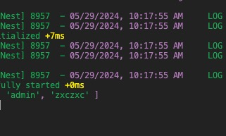
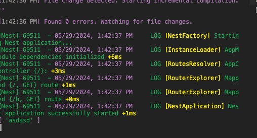

# 自定义装饰器

很多内置装饰器我们都可以自己实现。

```sh
nest g decorator aaa --flat
```

加个 Guard 取出来做一些判断：

```sh
nest g guard aaa --flat --no-spec
```

guard 里使用 reflector 来取 metadata

```ts
import {
  CanActivate,
  ExecutionContext,
  Inject,
  Injectable,
} from "@nestjs/common";
import { Reflector } from "@nestjs/core";
import { Observable } from "rxjs";

@Injectable()
export class AaaGuard implements CanActivate {
  @Inject(Reflector)
  private reflector: Reflector;

  canActivate(
    context: ExecutionContext
  ): boolean | Promise<boolean> | Observable<boolean> {
    console.log(this.reflector.get("aaa", context.getHandler()));

    return true;
  }
}
```

修改 controller

```ts
import { Controller, Get, SetMetadata, UseGuards } from "@nestjs/common";
import { AppService } from "./app.service";
import { AaaGuard } from "./aaa.guard";

@Controller()
export class AppController {
  constructor(private readonly appService: AppService) {}

  @Get()
  @UseGuards(AaaGuard)
  @SetMetadata("aaa", ["admin", "zxczxc"])
  getHello(): string {
    return this.appService.getHello();
  }
}
```

访问 localhost:3000



但是不同 metadata 有不同的业务场景，有的是用于权限的，有的是用于其他场景的。

但现在都用 @SetMetadata 来设置太原始了。

这时候就可以这样封装一层：

```ts
import { SetMetadata } from "@nestjs/common";

export const Aaa = (...args: string[]) => SetMetadata("aaa", args);
```

```ts
import { Controller, Get, UseGuards } from "@nestjs/common";
import { AppService } from "./app.service";
import { AaaGuard } from "./aaa.guard";
import { Aaa } from "./aaa.decorator";

@Controller()
export class AppController {
  constructor(private readonly appService: AppService) {}

  @Get()
  @UseGuards(AaaGuard)
  // @SetMetadata('aaa', ['admin', 'zxczxc'])
  @Aaa("admin", "zxczxc")
  getHello(): string {
    return this.appService.getHello();
  }
}
```


还有，有没有觉得现在装饰器太多了，能不能合并成一个呢？

当然也是可以的。

这样写：

```ts
// bbb decoraotr.ts

import { applyDecorators, Get, UseGuards } from "@nestjs/common";
import { Aaa } from "src/aaa.decorator";
import { AaaGuard } from "src/aaa.guard";

export function Bbb(path, role) {
  return applyDecorators(Get(path), Aaa(role), UseGuards(AaaGuard));
}
```

```ts
import { Controller, Get, UseGuards } from "@nestjs/common";
import { AppService } from "./app.service";
import { AaaGuard } from "./aaa.guard";
import { Aaa } from "./aaa.decorator";
import { Bbb } from "./bbb/bbb.decorator";

@Controller()
export class AppController {
  constructor(private readonly appService: AppService) {}

  @Get()
  @UseGuards(AaaGuard)
  // @SetMetadata('aaa', ['admin', 'zxczxc'])
  @Aaa("admin", "zxczxc")
  getHello(): string {
    return this.appService.getHello();
  }

  @Bbb("/b", "asdasd")
  b() {
    return "bbb";
  }
}
```

访问 localhost:3000/b



此外，也可以自定义参数装饰器：

```ts
import { createParamDecorator, ExecutionContext } from "@nestjs/common";

export const Ccc = createParamDecorator(
  (data: string, ctx: ExecutionContext) => {
    return "ccc";
  }
);
```

```ts
import { Controller, Get, UseGuards } from "@nestjs/common";
import { AppService } from "./app.service";
import { AaaGuard } from "./aaa.guard";
import { Aaa } from "./aaa.decorator";
import { Bbb } from "./bbb/bbb.decorator";
import { Ccc } from "./ccc/ccc.decorator";

@Controller()
export class AppController {
  constructor(private readonly appService: AppService) {}

  @Get()
  @UseGuards(AaaGuard)
  // @SetMetadata('aaa', ['admin', 'zxczxc'])
  @Aaa("admin", "zxczxc")
  getHello(): string {
    return this.appService.getHello();
  }

  @Bbb("/b", "asdasd")
  b() {
    return "bbb";
  }

  @Get("/c")
  c(@Ccc() c) {
    console.log(c);
    return "ccc";
  }
}
```

拿到的 c 就是装饰器返回的 c

回过头来看看这个装饰器：

data 很明显就是传入的参数，而 ExecutionContext 前面用过，可以取出 request、response 对象。

这样那些内置的 @Param、@Query、@Ip、@Headers 等装饰器，我们是不是能自己实现了呢？

```ts
import { createParamDecorator, ExecutionContext } from "@nestjs/common";
import { Request } from "express";

export const MyHeaders = createParamDecorator(
  (key: string, ctx: ExecutionContext) => {
    const request: Request = ctx.switchToHttp().getRequest();
    return key ? request.headers[key.toLowerCase()] : request.headers;
  }
);
```

再来实现下 @Query 装饰器：

```ts
export const MyQuery = createParamDecorator(
  (key: string, ctx: ExecutionContext) => {
    const request: Request = ctx.switchToHttp().getRequest();
    return request.query[key];
  }
);
```
