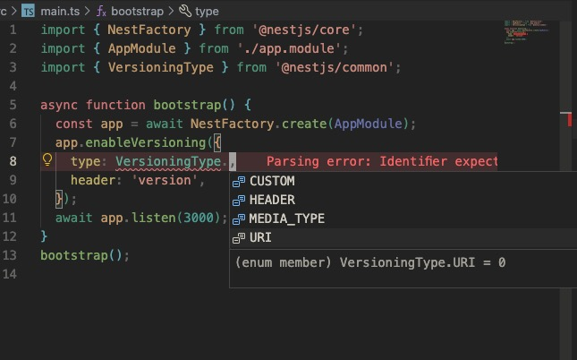

# 接口如何实现多版本共存

应用开发完一版上线之后，还会不断的迭代。

后续可能需要修改已有的接口，但是为了兼容，之前版本的接口还要保留。

那如何同时支持多个版本的接口呢？

```ts
import { Controller, Get, Version } from "@nestjs/common";
import { AppService } from "./app.service";

@Controller({
  version: "1",
})
export class AppController {
  constructor(private readonly appService: AppService) {}

  @Get()
  getHello(): string {
    return this.appService.getHello();
  }
  @Get()
  @Version("2")
  getHello2(): string {
    return "v2" + this.appService.getHello();
  }
}
```

在 controller 上标记为 version 1，这样默认全部的接口都是 version 1。

然后单独用 @Version 把 version 2 的接口标识一下。

在 main.ts 里调用 enableVersioning 开启接口版本功能：

```ts
import { VersioningType } from "@nestjs/common";
import { NestFactory } from "@nestjs/core";
import { AppModule } from "./app.module";

async function bootstrap() {
  const app = await NestFactory.create(AppModule);

  app.enableVersioning({
    type: VersioningType.HEADER,
    header: "version",
  });
  await app.listen(3000);
}
bootstrap();
```

之后在 header 里加上 version : 1

就可以访问 相同 url 不同版本的 api 了

但这时候有个问题：

如果不带版本号就 404 了。

这个也很正常，因为这就是版本一的接口嘛，只有显式声明版本才可以。

如果你想所有版本都能访问这个接口，可以用 VERSION_NEUTRAL 这个常量：

```ts
import { Controller, Get, VERSION_NEUTRAL, Version } from "@nestjs/common";
import { AppService } from "./app.service";

@Controller({
  version: VERSION_NEUTRAL,
})
export class AppController {
  constructor(private readonly appService: AppService) {}

  @Get()
  getHello(): string {
    return this.appService.getHello();
  }

  @Get()
  @Version("2")
  getHello2(): string {
    return "v2" + this.appService.getHello();
  }
}
```

但是现在因为从上到下匹配，版本 2 的接口不起作用了：

可以把 v2 的 api 挪到上面去

或者单独建一个 version 2 的 controller

```ts
import { Controller, Get, Version } from "@nestjs/common";
import { AaaService } from "./aaa.service";

@Controller({
  path: "aaa",
  version: "2",
})
export class AaaV2Controller {
  constructor(private readonly aaaService: AaaService) {}

  @Get()
  findAllV2() {
    return this.aaaService.findAll() + "222";
  }
}
```

现在版本 2 就走的 AaaV2Controller：其他版本走 AaaController：

一般我们就是这样做的，有一个 Controller 标记为 VERSION_NEUTRAL，其他版本的接口放在单独 Controller 里。

注意，controller 之间同样要注意顺序，前面的 controller 先生效：

不只有通过 header 来传递版本



如果是 url 传递版本 那么 VERSION_NEUTRAL 不生效
