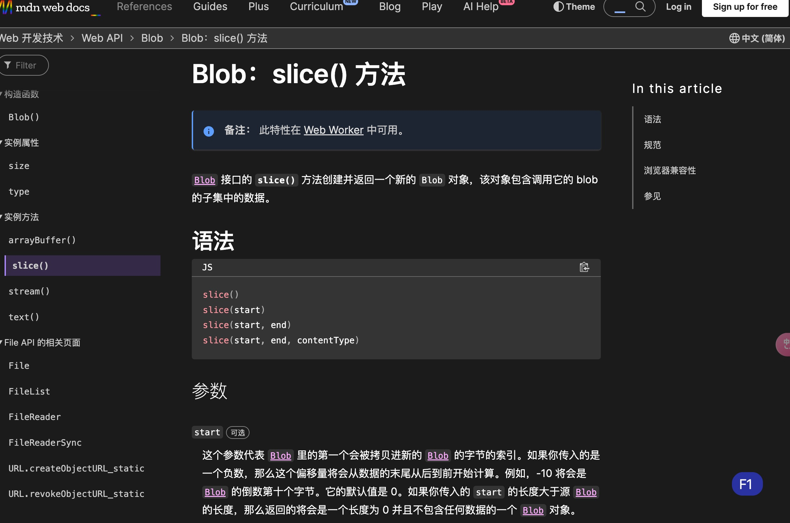

# 大文件上传

文件上传是常见需求，只要指定 content-type 为 multipart/form-data，内容就会以这种格式被传递到服务端

服务端再按照 multipart/form-data 的格式提取数据，就能拿到其中的文件。

但当文件很大的时候，事情就变得不一样了。

假设传一个 100M 的文件需要 3 分钟，那传一个 1G 的文件就需要 30 分钟。

这样是能完成功能，但是产品的体验会很不好。

所以大文件上传的场景，需要做专门的优化。

把 1G 的大文件分割成 10 个 100M 的小文件，然后这些文件并行上传，不就快了？

然后等 10 个小文件都传完之后，再发一个请求把这 10 个小文件合并成原来的大文件。

这就是大文件分片上传的方案。

那如何拆分和合并呢？

浏览器里 Blob 有 slice 方法，可以截取某个范围的数据，而 File 就是一种 Blob：

## Blob.slice()

Bolb.slice 方法会创建并返回一个新的`Blob`对象 该对象会调用他的 blob 的子集中的数据



所以可以在 input 里选择了 file 之后，通过 slice 对 File 分片。

那合并呢？

fs 的 createWriteStream 方法支持指定 start，也就是从什么位置开始写入。

这样把每个分片按照不同位置写入文件里，不就完成合并了么。

思路理清了，接下来我们实现一下。

```html
<!DOCTYPE html>
<html lang="en">
  <head>
    <meta charset="UTF-8" />
    <meta http-equiv="X-UA-Compatible" content="IE=edge" />
    <meta name="viewport" content="width=device-width, initial-scale=1.0" />
    <title>Document</title>
    <script src="https://unpkg.com/axios@0.24.0/dist/axios.min.js"></script>
  </head>
  <body>
    <input id="fileInput" type="file" multiple />
    <script>
      const fileInput = document.querySelector("#fileInput");

      const chunkSize = 20 * 1024;

      fileInput.onchange = async function () {
        const file = fileInput.files[0];

        console.log(file);

        const chunks = [];
        let startPos = 0;
        while (startPos < file.size) {
          chunks.push(file.slice(startPos, startPos + chunkSize));
          startPos += chunkSize;
        }

        chunks.map((chunk, index) => {
          const data = new FormData();
          data.set("name", file.name + "-" + index);
          data.append("files", chunk);
          axios.post("http://localhost:3000/upload", data);
        });
      };
    </script>
  </body>
</html>
```

```ts
import {
  Body,
  Controller,
  Get,
  Post,
  UploadedFiles,
  UseInterceptors,
} from "@nestjs/common";
import { existsSync, mkdirSync, rmSync, cpSync } from "node:fs";
import { AppService } from "./app.service";
import { FilesInterceptor } from "@nestjs/platform-express";

@Controller({})
export class AppController {
  constructor(private readonly appService: AppService) {}

  @Get()
  getHello(): string {
    return this.appService.getHello();
  }

  @Post("upload")
  @UseInterceptors(
    FilesInterceptor("files", 20, {
      dest: "uploads",
    })
  )
  uploadFiles(
    @UploadedFiles() files: Array<Express.Multer.File>,
    @Body() body: { name: string }
  ) {
    console.log("body", body);
    console.log("files", files);

    const fileName = body.name.match(/(.+)\-\d+$/)[1];
    const chunkDir = "uploads/chunks_" + fileName;

    if (!existsSync(chunkDir)) {
      mkdirSync(chunkDir);
    }
    cpSync(files[0].path, chunkDir + "/" + body.name);
    rmSync(files[0].path);
  }
}
```

我们把切片移动到单独的目录
用正则匹配出文件名

```ts
"asd.png-2".match(/(.+)\-\d+$/);
```

在 uploads 下创建 chunks\_文件名 的目录，把文件复制过去，然后删掉原始文件。

分片文件移动成功了。


但是文件名字容易冲突 可以在前端上传时候传一个 hash

接下来，就是在全部分片上传完之后，发送合并分片的请求。

```ts
  @Get('merge')
  merge(@Query('name') name: string) {
    const chunkDir = 'uploads/chunks_' + name;

    const files = readdirSync(chunkDir);

    let startPos = 0;
    files.map((file) => {
      const filePath = chunkDir + '/' + file;
      const stream = createReadStream(filePath);
      stream.pipe(
        createWriteStream('uploads/' + name, {
          start: startPos,
        }),
      );

      startPos += statSync(filePath).size;
    });
  }
```

调用这个 api 我们发现文件合并成功了


然后我们在合并完成之后把 chunks 目录删掉。

```ts
  @Get('merge')
  merge(@Query('name') name: string) {
    const chunkDir = 'uploads/chunks_' + name;

    const files = readdirSync(chunkDir);

    let count = 0;
    let startPos = 0;
    files.map((file) => {
      const filePath = chunkDir + '/' + file;
      const stream = createReadStream(filePath);
      stream
        .pipe(
          createWriteStream('uploads/' + name, {
            start: startPos,
          }),
        )
        .on('finish', () => {
          count++;

          if (count === files.length) {
            rm(
              chunkDir,
              {
                recursive: true,
              },
              () => {},
            );
          }
        });

      startPos += statSync(filePath).size;
    });
  }
```

至此，大文件分片上传就完成了。
