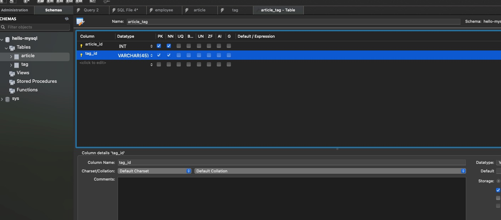
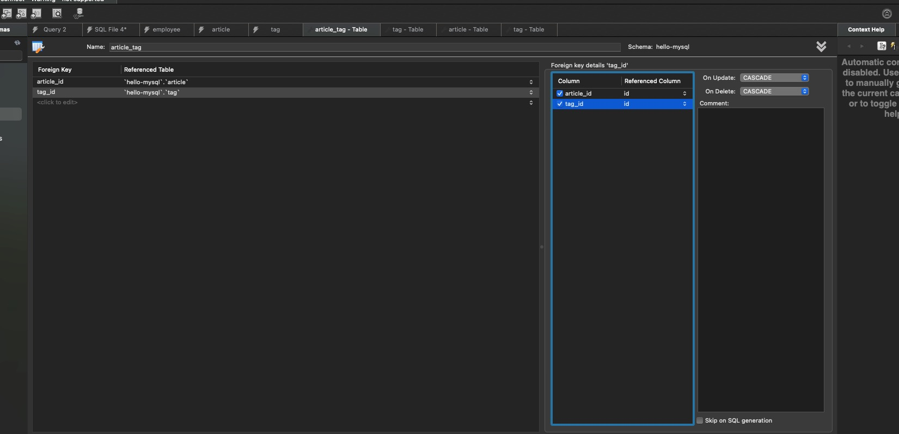

# 一对多、多对多关系的表设计

一对多的关系，比如一个部门有多个员工。

我们会有一个部门表和一个员工表：

部门表

分别指定 id 是 INT，约束为 primary key、not null、 auto increment 。

name 是 VARCHAR(45)，约束为 not null。

employee 表

添加 id、name、department_id 这 3 列。

然后添加一个外键约束，department_id 列引用 department 的 id 列。

设置级联删除和更新为 SET NULL。

因为部门没了员工不一定也没了，可能还会分配到别的部门

sql 的最后这段，就是创建了一个外键约束，department_id 引用了 department 表的 id，设置级联删除和更新方式为 SET NULL。

我们往部门表插入几条数据：

```sql
INSERT INTO `department` (`id`, `name`)
    VALUES
        (1, '人事部'),
        (2, '财务部'),
        (3, '市场部'),
        (4, '技术部'),
        (5, '销售部'),
        (6, '客服部'),
        (7, '采购部'),
        (8, '行政部'),
        (9, '品控部'),
        (10, '研发部');

```

再往员工表里插入几条数据：

```sql
INSERT INTO `employee` (`id`, `name`, `department_id`)
    VALUES
        (1, '张三', 1),
        (2, '李四', 2),
        (3, '王五', 3),
        (4, '赵六', 4),
        (5, '钱七', 5),
        (6, '孙八', 5),
        (7, '周九', 5),
        (8, '吴十', 8),
        (9, '郑十一', 9),
        (10, '王十二', 10);

```

查询下

```sql
select * from department
    join employee on department.id = employee.department_id
    where department.id = 5
```

一对多是不是还挺简单的？

确实，它和一对一没啥本质的区别。

接下来我们来看多对多。

比如文章和标签：

之前一对多关系是通过在多的一方添加外键来引用一的一方的 id。

但是现在是多对多了，每一方都是多的一方。这时候是不是双方都要添加外键呢？

一般我们是这样设计：

文章一个表、标签一个表，这两个表都不保存外键，然后添加一个中间表来保存双方的外键。

这样文章和标签的关联关系就都被保存到了这个中间表里。

我们试一下：

这次我们就直接通过 sql 建表了：

```sql
CREATE TABLE `article` (
 `id` INT NOT NULL AUTO_INCREMENT,
 `title` VARCHAR(50) NOT NULL,
 `content` TEXT NOT NULL,
 PRIMARY KEY (`id`)
) CHARSET=utf8mb4;

```

插入几条数据

```sql
INSERT INTO `article` (`title`, `content`)
    VALUES
            ('文章1', '这是文章1的内容。'),
            ('文章2', '这是文章2的内容。'),
            ('文章3', '这是文章3的内容。'),
            ('文章4', '这是文章4的内容。'),
            ('文章5', '这是文章5的内容。');

```

创建标签表 插入数据

```sql
CREATE TABLE `tag` (
 `id` INT NOT NULL AUTO_INCREMENT,
 `name` VARCHAR(50) NOT NULL,
 PRIMARY KEY (`id`)
);

INSERT INTO `tag` (`name`)
    VALUES
            ('标签1'),
            ('标签2'),
            ('标签3'),
            ('标签4'),
            ('标签5');

```

然后创建中间表

点击创建表，添加 article_id、tag_id 这俩列，设置为 NOT NULL。

注意，这里同时指定这两列为 primary key，也就是复合主键。

添加 article_id 和 tag_id 的外键引用：





```sql
CREATE TABLE `hello-mysql`.`article_tag` (
  `article_id` INT NOT NULL,
  `tag_id` INT NOT NULL,
  PRIMARY KEY (`article_id`, `tag_id`),
  INDEX `tag_id_idx` (`tag_id` ASC) VISIBLE,
  CONSTRAINT `article_id`
    FOREIGN KEY (`article_id`)
    REFERENCES `hello-mysql`.`article` (`id`)
    ON DELETE CASCADE
    ON UPDATE CASCADE,
  CONSTRAINT `tag_id`
    FOREIGN KEY (`tag_id`)
    REFERENCES `hello-mysql`.`tag` (`id`)
    ON DELETE CASCADE
    ON UPDATE CASCADE);

```

中间表的级联方式要设置为 CASCADE，这个是固定的。

因为它就是用来保存关系的，如果关联的记录都没了，这个关系也就没存在的意义了。

primary key (article_id, tag_id) 是指定复合主键。

后面分别是添加两个外键约束。

建表 sql 能看懂即可，不需要手写。

然后插入几条数据：

```sql
INSERT INTO `article_tag` (`article_id`, `tag_id`)
    VALUES
    (1,1), (1,2), (1,3),
    (2,2), (2,3), (2,4),
    (3,3), (3,4), (3,5),
    (4,4), (4,5), (4,1),
    (5,5), (5,1), (5,2);

```

那现在有了 article、tag、article_tag 3 个表了，怎么关联查询呢？

JOIN 3 个表呀！

```sql
SELECT * FROM article a
    JOIN article_tag at ON a.id = at.article_id
    JOIN tag t ON t.id = at.tag_id
    WHERE a.id = 1
```

当然，一般我们会指定返回的列：

```sql
SELECT t.name AS 标签名, a.title AS 文章标题
    FROM article a
    JOIN article_tag at ON a.id = at.article_id
    JOIN tag t ON t.id = at.tag_id
    WHERE a.id = 1
```

我们把文章 1 删除试试：

可以看到关系也被级联删除了，这就是 CASCADE 的作用。
当然，删除的只是关系，并不影响 id=1 的标签：
