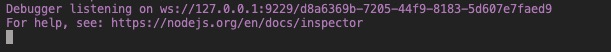
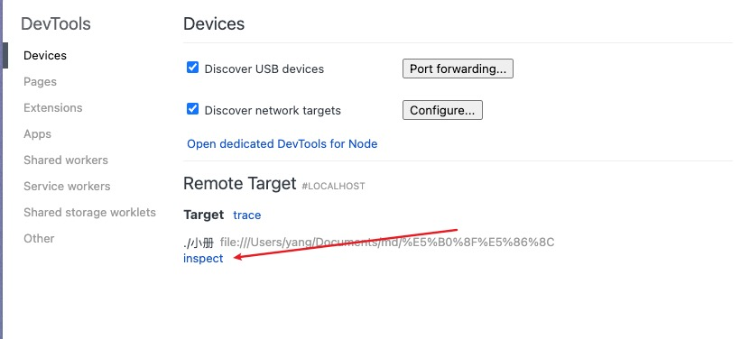

# 调试 nodejs

```bash
node --inspect-brk ./index.js
```



## 用 Chrome DevTools 调试 node 代码

打开 [chrome://inspect/#devices](chrome://inspect/#devices)，下面列出的是所有可以调试的目标，也就是 ws 服务端：

之后点击 inspect



## 用 VSCode Debugger 调试 node 代码

可以用 node attach 连接到刚才的 port
也可以直接 node launch 指定程序的入口

如果你也想首行断住，可以加一个 stopOnEntry 的配置
和 node --inspect-brk 一样的效果

## node debuuger 的历史

node 刚开始不是走 cdp 协议的
node 是 V8 debug protocol

但是这样 ui 不太方便 所以有一个 pr 把 V8 inspector 集成到 nodejs 中

之后 Node.js 就在 v6.3 中加入了这个功能：

并且在成熟之后去掉了对 v8 debug protocol 的支持，也就是废弃了 node debug 命令，改为了 node inspect。

启动 ws 调试服务的方式就是 node --inspect 或者 node --inspect-brk。
