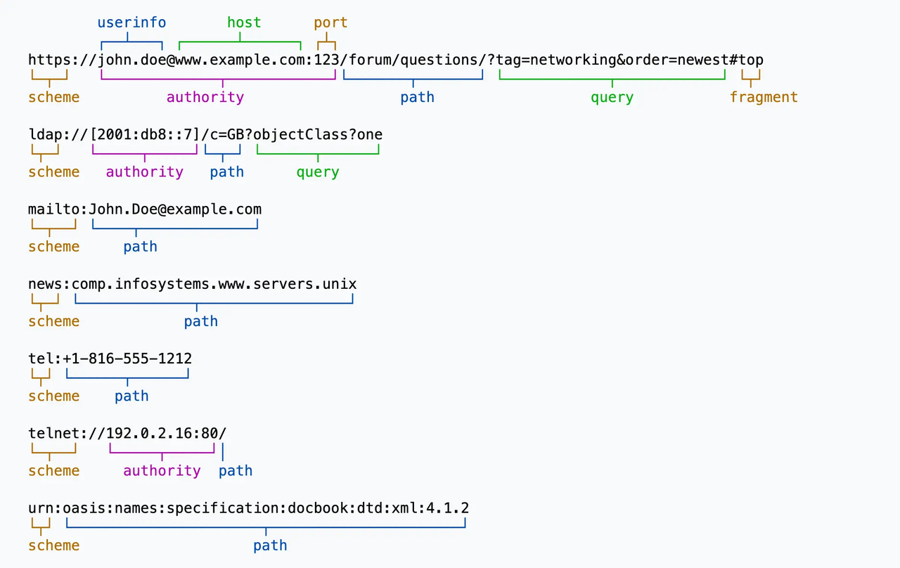
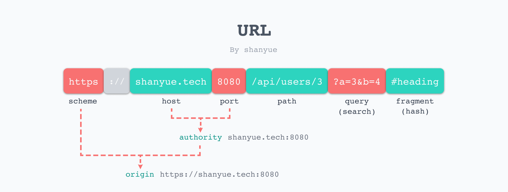
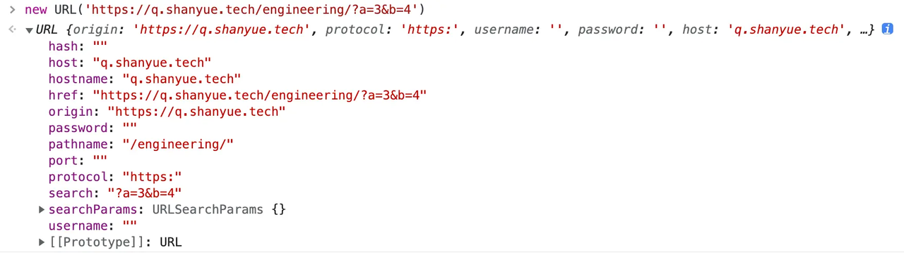

# 资源与 URI

在 HTTP 中，使用 URI 指定唯一资源。

## URI

URI，`Uniform Resource Identifiers`，统一资源标识符。它适用于多种协议，以下都属于 URI。

```bash
https://developer.mozilla.org/en-US/docs/Learn
git@github.com:shfshanyue/node-examples.git
ftp://shanyue.tech/http-train.zip
data:,Hello%2C%20World!
```



而 URL 一般指 HTTP 协议的 URI。



## URI 组成部分

URI 由以下部分组成，详见 [MDN: Identifying resources on the Web](https://developer.mozilla.org/en-US/docs/Web/HTTP/Basics_of_HTTP/Identifying_resources_on_the_Web)，[RFC 9110: URI](https://httpwg.org/specs/rfc9110.html#uri) 及 [wiki: URI](https://httpwg.org/specs/rfc9110.html#uri)

- `protocol`。包含 http/ssh/ftp 等。
- `authority`。包含 `userinfo`/`host`/`port`，其中 `userinfo` 与 `port` 可选。
- `path`
- `query`，在 URI 的后缀有 `?a=3&b=4` 被称为 `query`，也被称为 `search`，可通过 `URLSearchParams API` 进行解析。
- `fragment`，在 URI 的后缀有 `#app` 被称为 `fragment`，也被称为 `hash`

## URL API

在浏览器/node.js 中，通过 [URL API](https://developer.mozilla.org/zh-CN/docs/Web/API/URL_API) 可解析 URL 的各个部分。

```js
new URL("https://q.shanyue.tech/engineering/?a=3&b=4");
```



## URLSearchParams API

在浏览器/node.js 中，[URLSearchParams API](https://developer.mozilla.org/zh-CN/docs/Web/API/URLSearchParams) 用以处理 URL 的查询字符串。

```js
const params = new URLSearchParams({ a: 3, b: 4 });

// 也可以接收字符串
// const params = new URLSearchParams('a=3&b=4')

//=> 3
params.get("a");

//=> a=3&b=4
params.toString();

//=> {a: '3', b: '4'}
Object.fromEntries(params.entries());
```

其中，通过 URL API 也可以获取到 query，代码如下：

```js
const url = new URL("https://q.shanyue.tech/engineering/?a=3&b=4");

//=> {a: '3', b: '4'}
Object.fromEntries(url.searchParams.entries());
```

## URI 与 URL 的区别

一般来讲，URL 是 URI 的子集，但在目前的 [RFC 9110](https://www.rfc-editor.org/rfc/rfc9110.html) 中，都使用 URI 这个词来表示 HTTP 上的资源。见 RFC [9110 Identifiers in HTTP](https://www.rfc-editor.org/rfc/rfc9110.html#name-identifiers-in-http)。

- [HTTP 协议中 URI 和 URL 有什么区别？](https://www.zhihu.com/question/21950864)
- [What is the difference between a URI, a URL, and a URN?](https://stackoverflow.com/questions/176264/what-is-the-difference-between-a-uri-a-url-and-a-urn)
